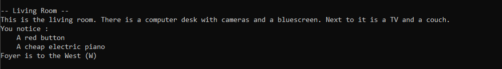
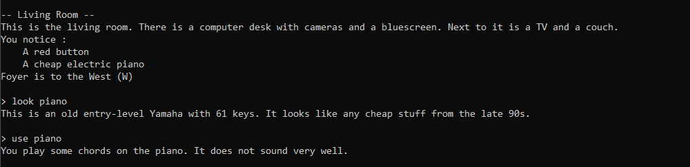
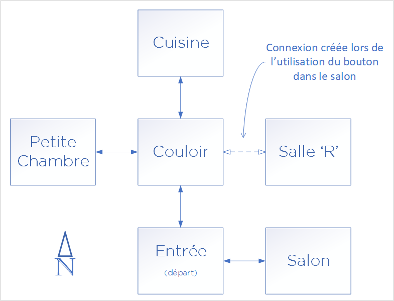
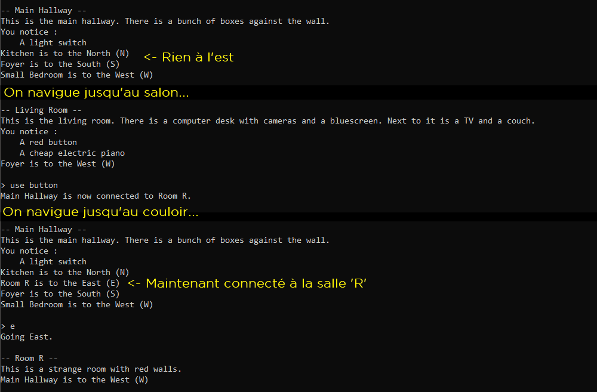
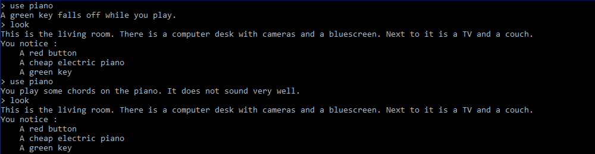
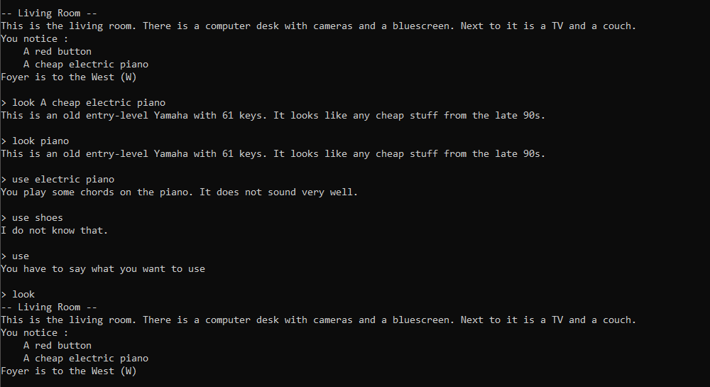

# Projet de session - Été 2022

**Objectifs** : Introduire l’étudiant à la conception de programmes orientés objet en faisant des choix par rapport aux différents concepts vus dans ce cours. 

**Durée** : Presque toute la session.

**Livrables** :  
1. Évaluation 1 : Remise le 1er juin à 23h59 + Évaluation le 2 juin (créneau de rendez-vous pour chaque équipe)
1. Évaluation finale : Remise le 15 juin à 23h59 + Évaluation le 16 juin (créneau de rendez-vous pour chaque équipe)

## Directives particulières

- Vous devez suivre les bons principes de programmations appris dans le cours.
- Le côté artistique visuel n’est pas dans les critères d’évaluation, mais l'implémentation correcte d'une interface en ligne de commande et son utilisabilité le sont.
- Vous pouvez récupérer une partie des points perdus dans un livrable si vous corrigez les problèmes pour la remise finale. Pour cette raison, aucun solutionnaire ne sera donné, mais vous aurez des commentaires sur ce que vous avez fait.
- Le premier livrable est évalué principalement sur la conception et la fonctionnalité de base. Le travail aura une bonne proportion de l’évaluation sur le fonctionnement.
- Respectez le guide de codage, les points pertinents pour ce travail sont les mêmes que pour les TD.
- N’oubliez pas de mettre les entêtes de fichiers (guide point 33).
- Vous avez le droit d'utiliser des bibliothèques tierces telles que boost, cppitertools, gsl et tclap, mais seulement si leur utilisation n'affecte pas les objectifs pédagogiques du projet. Par exemple, si dans le projet on vous demande de développer un module d'opérations matricielles, vous ne pouvez pas utiliser une bibliothèque d'algèbre linéaire à la place. Toutefois, vous pourriez utiliser boost-format ou boost-algorithm pour faire de l'affichage formaté, vu qu'on ne vous évalue pas particulièrement sur votre capacité à manipuler des string à la main pour formater et que c'est complémentaire à ce qui est déjà présent dans la librairie standard de C++.
- Dans le dossier *Projet* vous trouverez une solution Visual Studio, un CMakeList et un JSON pour VSCode, tous fonctionnels et configurés pour Vcpkg, mais vous n'êtes pas obligés de vous en servir. Ce sont juste les fichiers de l'exemple disponible sur Moodle. Vous gérez vous-même votre environnement de développement.

## Description des nouvelles fonctionnalités du jeu

On ajoute des fonctionnalités par-dessus celles du livrable 1, qui étaient la navigation et l'observation des zones dans la carte. Vous pouvez vous référez à [README_Livrable1](README_Livrable1.md) pour le rappel de la description du livrable 1.

### Objets interactifs

En plus d'un nom et d'une description, une zone de la carte peut contenir des objets avec lesquelles le joueur peut interagir. Un objet interactif possède un nom et une description. Lorsqu'on affiche la description d'une zone, on affiche aussi le nom des objets interactifs présents dans la zone.

En regardant un objet avec la même commande que pour décrire une zone (`look` dans notre exemple), on obtient sa description. On peut utiliser l'objet avec une autre commande (`use` dans notre exemple), dont le message retourné dépend de l'objet.

<!--
### Inventaire

TODO: On le fait ou pas?
-->

### Objets déverrouillant de nouvelles zones

En interagissant avec certains objets, on veut pouvoir déverrouiller de nouvelles zones précédemment inaccessibles. Reprenons notre carte de l'exemple du livrable 1, mais en ajoutant une zone cachée (la *Salle R*) à l'est du couloir. Au départ, la salle n'est pas accessible à partir de ce dernier. En utilisant le bouton rouge qui se trouve dans le salon, la connexion se crée et l'accès à la salle est déverrouillé.

### Objets montrant des nouveaux objets
Comme pour ajouter l'accès à une zone (ci-dessus), interagir avec un objet pourrait montrer un objet qui n'était pas avant visible. Attention qu'interagir plusieurs fois ne devrait pas ajouter plusieurs fois l'objet. Noter que ceci n'est qu'un exemple, où le piano est modifié par rapport à l'exemple précédent: il y a un effet lorsqu'on l'utilise et un message différent à ce moment.

### Traitement des commandes d'objets

Les commandes `look` et `use` permettent d'interagir avec des objets. Il faut toutefois spécifier quel objet on veut regarder ou utiliser. On veut que la commande soit suivie d'une chaîne de caractère (possiblement avec des espaces) qui contient comme sous chaîne un des mots importants associés à l'objet. Par exemple, l'objet avec le nom `A black leather jacket` pourrait être observé en faisant `look black leather jacket`, ou en faisant `look jacket`, car `black leather jacket` et `jacket` sont toutes deux des sous chaînes de `A black leather jacket`. Si plusieurs objets respectent le critère de recherche, on prend le premier trouvé.

Les mêmes règles de recherches s'appliquent pour `use` et pour `look`. Si on fait `look` sans rien après, on a le même comportement qu'au livrable 1, c'est-à-dire obtenir la description de la zone. `use` ne peut pas être utilisé sans argument.

### Affichage de la liste des commandes et fermeture du jeu
Nous voulons d'abord une commande `exit` qui permet de quitter le jeu en affichant un message quelconque.

Nous voulons aussi une commande `help` pour pouvoir afficher la liste des commandes disponibles avec une courte description de ce qu'elles font.

Certaines commandes peuvent être activées par différentes chaînes de caractères (par exemple north ou N pour aller au nord), il faut donc accepter des synonymes pour chaque commande et ceux-ci doivent être listés dans l'affichage.

## Description du livrable 2

Vous devez implémenter toutes les fonctionnalités présentées dans la description du projet ci-dessus et avoir une version fonctionnelle de votre jeu dans lequel on peut naviguer à travers la carte du monde, interagir avec des objets et utiliser toutes les fonctionnalités décrites ci-dessus. 

Comme dans le livrable 1, il faut donner à l'utilisateur une certaine rétroaction sur les commandes qu'il entre. Par exemple, utiliser la commande `use` sans arguments devrait afficher un message disant spécifiquement que la commande `use` doit être utilisée avec un nom d'objet ou un mot-clé.

### Conception (suite)

Les éléments importants de conception du livrable 1 s'appliquent tous aussi au livrable 2.

### **Orienté objet et héritage pour réduire les if/else/switch/case**
On vous demande aussi maintenant d'avoir différents types d'objets interactifs dans les zones.  Ils ont en commun le fait qu'ils ont un nom et une description et une action à appliquer. Le nom est affiché quand on liste les objets d'une zone et la description est donnée quand on observe l'objet (commande look). L'action est déclenchée par la commande use et l'effet dépend du type de l'objet.  Le code de l'action devrait être associé au type d'objet (ou à l'objet lui-même), pas être dans une séries de if/else pour déterminer quoi appliquer pour l'objet.

### Déverrouillage de nouvelles zones

Quand vous déverrouillez une nouvelle zone en utilisant un objet, ça devrait seulement créer une nouvelle connexion, pas une nouvelle zone en soi. La zone cachée devrait être déjà créée comme les autres zones et présente dans la carte du jeu, mais elle est seulement inaccessible avant d'utiliser l'objet approprié.

Durant l'évaluation, on vous demandera de créer une zone et de la connecter à une des zones existantes.

